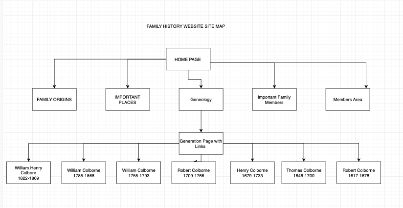

## FAMILY HISTORY WEBSITE   

#### Purpose of the Website

I have done a lot of research into my family history. I would like to make a website that my extented family (especially those in England) can use for researching the family. It will also allow me to work on my web development skills and help me to solitify what i have learnt during our lessons on HTML and CSS. 

#### Tech Stack

I will employ CSS and HTML through the use of SASS. I will also try and add some JAVA script minimally to the site, to gain some knowledge of this programming language. Ruby on Rails will also be used to create a sign up page and an emailing list for those who are interested in the site. The website will originally be hosted on Netlify 

#### Target Audience/Engaging Audience

The target audience is really myself, my family and my more distant relations. The family tree goes back to 1480 so many hundreds of thousands of people are related to the original ancestors i will mention. The tree will go back to my 12th Great-Grandfather. At this stage i have 16,384 12th Great-Grandparents. So, there will people all over the world who share these ancestors. 

By making my website flow logically and intellegently, i hope to engage the audience. I will attempt not to overload with information and design the website so that the user can easily navigate to the portions of the website that is most interesting to them. 

#### Functionality/Features

##### Easy of navigation/Easy of use  

The website will have be easy to navigate. The most easily navigated to pages from the home page will be the least content heavy. As the user moves around the site it will enable them to get into more specific information based on their needs. 

##### Sign-up

A sign-up page that implements Ruby on Rail to encourage people to stay in touch. I will also create a comment section for members. Here they can contribute their own research and comments. 

##### User Accessibility 

I will try and employ methods to make the website accessible to those with visual disabilities. 

##### TopNav

A topnav bar that will make user experience much more friendly 

##### Flexbox

Use of Flexboxes to make the images in the page work well.

##### Media Breakpoints 

To make the website look appealing on both mobile and desktop. 

#### Site Map 

The website will contain the following pages. 

1. Home Page with links to the other main pages. 
2. A family origins page 
3. Important places page
4. Important Family members page 
5. Members area
6. Geneology page
  6.1- William Henry Colborne 1822-1869 generation 
  6.2- William Colborne 1785-1868 generation
  6.3- William Colborne 1755-1793 generation
  6.4- Robert Colborne 1709-1766 generation 
  6.5 Henry Colborne  1679-1733 generation 
  6.6 Thomas Colborne 1646-1700 generation 
  6.7 Robert Colborne 1617-1678 generation 

he other pages should link to the Geneology section of the website which will then be self-contained. I think this is the best way to organise it. 

#### Information for website pages 

##### 1. Home page

The home page will introduce people to the site, state it's purpose and welcome people to the page. It will have some photos of ancestors and the like. It will feature a locked top nav bar for ease of navigation on either mobile or desktop and will have internal links to the other sections of the website.

##### 2. A family origins page

I will talk about the oldest records that exist for the family. 
Introduce laycock(lacock). 
Talk about the eldest records from the parish church. 
Mention churchwarders and issac colborne 1640 sentencing 
Talk about what the family did and how they became established. 

##### 3. Important Places Page 

On this page i will talk about the Colborne's who are listed in the memorials at Lacock Church. I will about the houses that the family had. I will talk about the move to Chippenham and the family members who became mayors of the town. I will talk about Hardenhuish house and St Nicholas Church Chippenham. This page will also included photos of the houses on St Mary's street owned by the family. 

##### 4. Influencial Family Members 

- Sir John Colborne (Distant Cousin- govenor of Upper Canada, Field Marshal, decendant of Colborne's of Lacock)
- Baron Colborne of West Hardling (Cousin- Baron Colborne son of Sarah Colborne. Member of Parliment. Created Baron 1839)
- Viscount Ridley (Cousins- Last common ancestor Thomas Colborne)
- William Colborne esq- (MRCS) (Great-Great-Great Grandfather, Mayor of Chippenham 6 times. Member of town counci for 50 years)
- Joseph Colborne (My uncle, first family member to become Mayor of Chippenham 1714?)
- Joseph Colborne esq. (Cousin, son of first mayor (Joseph Colborne) and mayor himself, sheriff of Wiltshire in 1779, owner of Hardenhuish House, and builder of St Nicholas Church. (His brother Willam and Benjamin could also get a mention)
- William Henry Colborne esq. (FRCS, LSA, M.D,) great-great grandfather- probable mayor of 1869 
- Thomas Colborne esq. uncle- William Henry's brother. Lord of the manor, somewhere in Wales. Wealthy solictor. (monmothshire)

